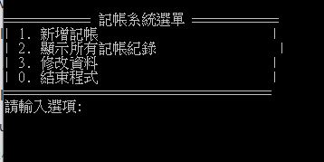

<h1>組別號碼:第4組</h1>
<h1>資工1A</h1>
<h1>成員資訊/h1>

組長: 劉奕宏 B3201738， 組員:B3230738 溫濟澤 B3230720 何秉翰

<h2>小專題題目:記帳系統</h2>

<h1>分工細節</h1>
<h2>溫濟澤</h2>

1.完成main函式

2.完成accountBook.cpp

3.完成enter.cpp

4.參與報告製作

5.參與主題討論

6.程式碼除錯

<h2>劉奕宏</h2>

1.完成報告大部分內容

2.參與主題討論

3.討論程式碼設計

4.參與報告製作

5.程式碼除錯

6.程式基礎建置

<h2>何秉翰</h2>

1.UML設計與完成

2.參與主題討論

3.程式基礎建置

4.參與報告製作

5.程式碼除錯

6.新增檔案紀錄功能

## 運行規則:
這是一個記帳的程式，一開始會產生可供輸入的選項，來引導輸入，共有3個功能，輸入數字來判斷執行甚麼選項 1新增資料 2.顯示先前紀錄 3.修改紀錄，0.結束程式運行
## 程式用法:
輸入數字1 2 3 0 來判斷輸入選項。
## 程式如何安裝執行
* 在GitHub下載Final project資料夾
* 點擊Download ZIP
* 解壓縮
* 打開exe檔 即可使用
## 程式圖片

